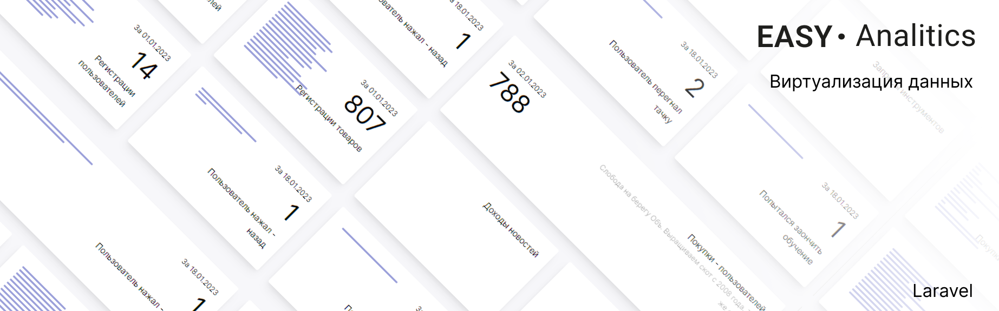

<p align="center">

</p>

## EasyAnalitics

Кароч изи пакет для вывода и записи аналитики. Минималка.
Установить его проще чем отобрать у ребенка детсво с помощью php.
Есть генерация тестовых данных.

### Как на картинке!

В одну строчку сразу выводятся вьюшки-блоки как на картинке!
Без js пока что
Ставь, с кайфом сделано. Не надо в гугл аналитикс лезть и душнится.
Функций меньше чем 0, просто записать колв, инкрементировать, вывести.

## Установка

1) Установить из композера

```  
composer require slavawins/easyanalitics
```

2) Опубликовать вендоры. Просто запусти
   Вызывать команду:
   ```
   php artisan vendor:publish --provider="SlavaWins\EasyAnalitics\Providers\EasyAnaliticsServiceProvider"
   ``` 


3) Выполнить миграцию

 ```
    php artisan migrate 
 ```  

## Вывести красивую вьюшку со статистикой

В любом вью впишите это подключение

 ```
  @include("easyanalitics::example.example")
 ``` 

Так же вам в папку вью скопирован этот пример, можете из неё подключить так:

 ```
  @include("easyanalitics.example")
 ``` 

<BR>

## Тестовые данные

Запустите неск раз команду на создание тестовых данных. Оно создать аналитику и заполнит её на неск дней.

 ```
  php artisan easyanalitics
 ``` 

# Использование

## Записать аналитику

Для записи данных всего одна функция

 ```
    EasyAnaliticsHelper::Increment("user_click_registration", 1, "Пользователь нажал - назад");
 ``` 

user_click_registration - индификатор, ключ. Под которым будет вестись статистика
1 - сколько нужно записать данных
"Пользователь нажал - назад" - как при выводе будет называться эта аналитика
Дополнительный аргумент - Carbon дата на которую нужно сделать записть

Можно вызвать вот так. Оно просто +1 допишет.

 ```
    EasyAnaliticsHelper::Increment("user_click_registration");
 ``` 

## Вывод

Посмотрите эксемпл. 
